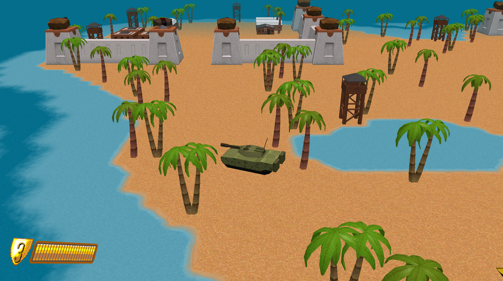

# FireStorm
## This game was created for the major assignment required by the game programming course at Conestoga. Using MonoGame and C#
### CustomXNAFramework library was designed to replicate Unity3D's framework
### RBeausoleilPROG2370FinalAssignment libary is the entirety of the game's code, ie: loading assets, controlling game components, menus, etc.

[Watch Video on YouTube](https://youtu.be/Hooshu3dcqs)

#### Special thanks to Steve Hendrikse (game programming professor) for unintentionally inspiring me to learn how to make a 3D game in MonoGame
